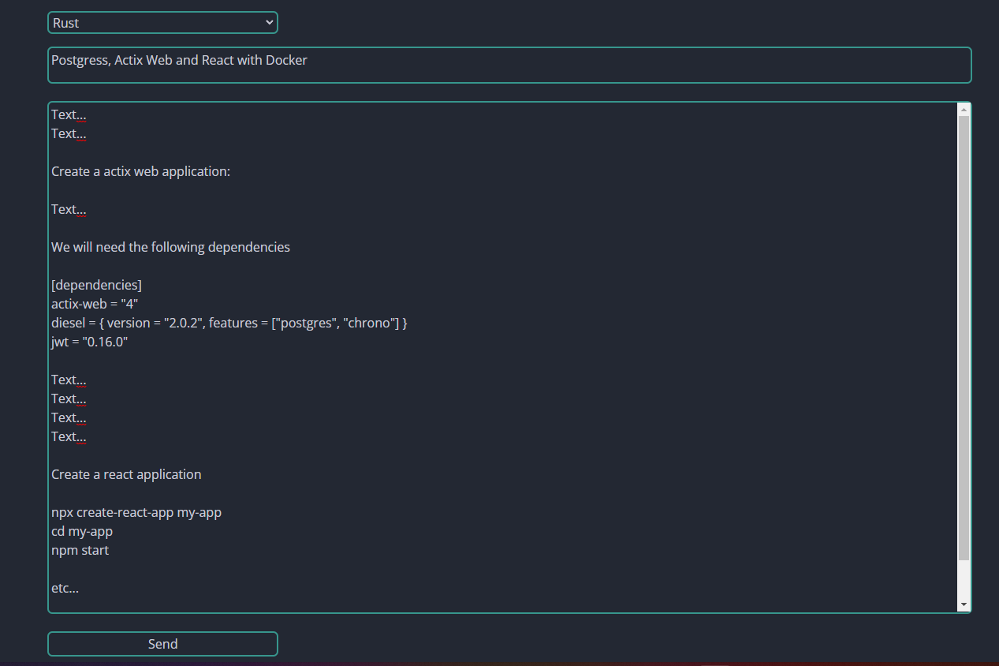
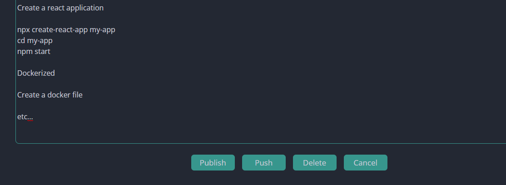
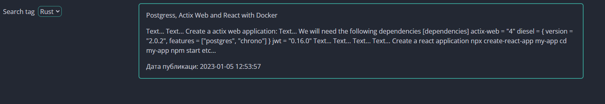
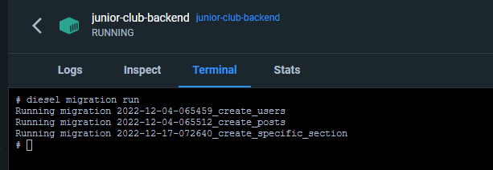

# Junior Club Application

#### This is a simple application for publishing articles on programming mainly in Java and Rust

*  Create account and login

*  Create post

*  Edit post

*  Search posts

#### The project consists of three separate containers

* PostgreSQL database
* Rust backend (Actix Web)
* React frontend

### Prerequisites
In order to run this application you need to install two tools: Docker & Docker Compose.

Instructions how to install Docker on [Ubuntu](https://docs.docker.com/engine/install/ubuntu/), [Windows](https://docs.docker.com/desktop/install/windows-install/), [Mac](https://docs.docker.com/desktop/install/mac-install/).

Docker Compose is already included in installation packs for Windows and Mac, so only Ubuntu users needs to follow [this instructions](https://docs.docker.com/compose/install/).

### How to run it?

Run application

    docker-compose up

Run migration in docker terminal

    diesel migration run

#### If you want to run the application piece by piece for development, see:
* [Backend](backend/README.md)
* [Frontend](frontend/README.md)